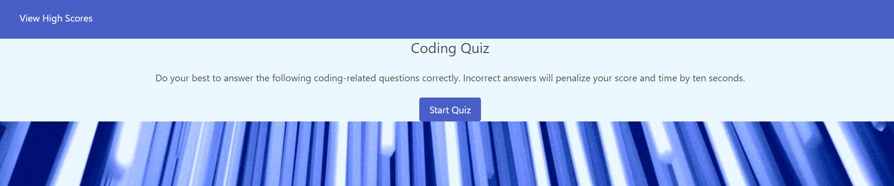

# new-coding-quiz

## Description
  The beginning of a coding quiz that will be updated in the future. Features to be added: Timer, Initials form, High Scores page with local storage implemented.

 ## Table of Contents

  - [Installation](#Installation)
  - [Website](#Website)
  - [Usage](#Usage)
  - [Screenshot](#Screenshot)
  

  ## Installation
  Use git clone in git bash after copying the link at https://github.com/jreese8/new-coding-quiz.

  ## Website
  https://jreese8.github.io/new-coding-quiz/

  
  ## Usage
  This application can be used to test your knowledge on JavaScript concepts.

  ## Screenshot
  